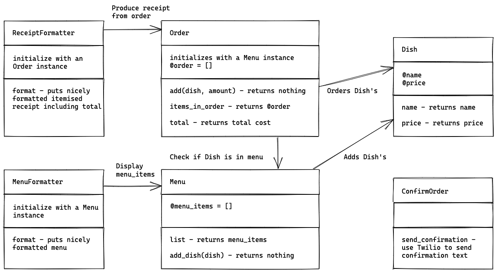
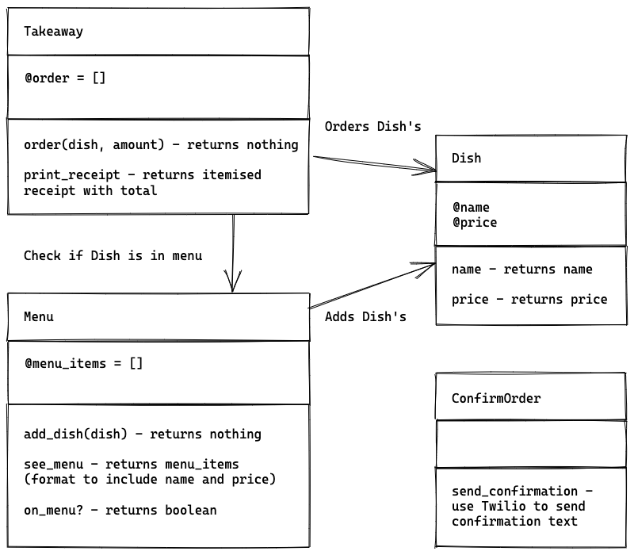

# Takeaway Project

Golden square phase 4 - solo project.

This project creates a takeaway where a user can see a menu, order items and get a receipt for their order. It also utilises Twilio to send a text message confirmation of order.

## Design

### 1. Describe the Problem

These are the user stories:

> As a customer  
> So that I can check if I want to order something  
> I would like to see a list of dishes with prices.
>
> As a customer  
> So that I can order the meal I want  
> I would like to be able to select some number of several available dishes.
>
> As a customer  
> So that I can verify that my order is correct  
> I would like to see an itemised receipt with a grand total.
>
> As a customer  
> So that I am reassured that my order will be delivered on time  
> I would like to receive a text such as "Thank you! Your order was placed and will be delivered before 18:52" after I have ordered.

### 2. Design the Class System

#### Outline

- Dish class - will initialize with a name of dish and price. It will have two methods to return the name and the price.
- Menu class - will initialize with an empty array which will hold a list of Dish instances. It will have three methods - to list the menu items, add dishes to the menu and to check if a Dish is on the menu.
- MenuFormatter class - will initialize with a Menu instance and have one method to format the menu.
- Order class - it will initialize with a Menu instance, an empty order array and a total. It will have one method - which will allow the user to order some number of dishes and it will check the dish is on the menu, add it to the order and calculate the total order price.
- ReceiptFormatter - will initialize with an Order instance and have one method to return a formatted receipt with order details and total.
- ConfirmOrder class - will utilise Twilio to send a text to confirm an order has been made. Based on the user story, the text contents does not contain the order details - so I have chosen not to initialize this with an Order class instance.



```ruby
class Dish
    def initialize(name, price) # name is a String, price is a Float
    end

    def name
        # returns name
    end

    def price
        # returns price
    end
end

class Menu
    def initialize
        # initialize with an empty menu_items array
    end

    def list
        # returns menu_items
    end

    def add_dish(dish) # dish is a Dish instance
        # adds dish to the menu
    end

    def on_menu?(dish) # dish is a Dish instance
        # returns boolean
    end
end

class MenuFormatter
    def initialize(menu) # menu is a Menu instance
    end

    def format
        # puts nicely formatted menu
    end
end

class Order
    def initialize(menu) # menu is a Menu instance
        # initialize with an empty order array and total
    end

    def order(dish, amount) # dish is a Dish instance, amount is an integer.
        # Check if dish is on menu
        # Adds dish to array amount number of times.
        # Update total
    end
end

class ReceiptFormatter
    def initialize(order) # order is an Order instance
    end

    def format
        # puts nicely formatted receipt
    end
end

class ConfirmOrder
    def send_confirmation
        # use Twilio to send order confirmation text
    end
end
```

### 3. Examples of integration tests

```ruby
# => As a customer
# => So that I can check if I want to order something
# => I would like to see a list of dishes with prices.

# 1 - adds a dish to the menu
menu = Menu.new
dish = Dish.new("pad thai", 7.50)
menu.add_dish(dish)
expect(menu.list).to eq [dish]

# 2 - adds multiple dishes to the menu
menu = Menu.new
dish_1 = Dish.new("pad thai", 7)
dish_2 = Dish.new("green curry", 8.5)
dish_3 = Dish.new("red curry", 8.75)
menu.add_dish(dish_1)
menu.add_dish(dish_2)
menu.add_dish(dish_3)
expect(menu.list).to eq [dish_1, dish_2, dish_3]

# 3 - see menu with dishes and prices
menu = Menu.new
item_1 = Dish.new("Pad Thai", 7.50)
item_2 = Dish.new("Red Curry", 8.50)
item_2 = Dish.new("Green Curry", 8.50)
menu.add_dish(item_1)
menu.add_dish(item_2)
menu.add_dish(item_3)
menu_formatter = MenuFormatter.new(menu)
# Expect formatted menu

# => As a customer
# => So that I can order the meal I want
# => I would like to be able to select some number of several available dishes.

#  - return false if dish not on menu
menu = Menu.new
item_1 = Dish.new("Pad Thai", 7.50)
item_2 = Dish.new("Green Curry", 7.50)
menu.add_dish(item_1)
expect(menu.on_menu?(item_2)).to eq false


# => As a customer
# => So that I can verify that my order is correct
# => I would like to see an itemised receipt with a grand total.

# 2 add items to order and print receipt
menu = Menu.new
item_1 = Dish.new("Pad Thai", 7.50)
item_2 = Dish.new("Red Curry", 8.50)
item_2 = Dish.new("Green Curry", 8.50)
menu.add_dish(item_1)
menu.add_dish(item_2)
menu.add_dish(item_3)
takeaway = Takeaway.new(menu)
takeaway.order(item_2, 1)
takeaway.order(item_3, 3)
expect(takeaway.print_receipt).to eq # formatted receipt


# 3 - raise error if selected dish not on menu
menu = Menu.new
item_1 = Dish.new("Pad Thai", 7.50)
item_2 = Dish.new("Red Curry", 8.50)
menu.add_dish(item_1)
menu.add_dish(item_2)
takeaway = Takeaway.new


# => As a customer
# => So that I am reassured that my order will be delivered on time
# => I would like to receive a text such as "Thank you! Your order was placed and will be delivered before 18:52" after I have ordered.
```

### 4. Examples of unit tests

```ruby
# Dish class
# "constructs"
dish = Dish.new("pad thai", 7.50)
expect(dish.name).to eq "pad thai"
expect(dish.price).to eq 7.5

# "fails if name is not a string"
expect{ Dish.new(1, 7.50) }.to raise_error "name should be a string"

# "fails if price is not a number"
expect{ Dish.new("pad thai", true) }.to raise_error "price should be a number"
expect{ Dish.new("pad thai", "green curry") }.to raise_error "Price should be a number"

# Menu class"
# fails if dish is not a Dish instance
menu = Menu.new
expect { menu.add_dish("dish") }.to raise_error "dish should be an instance of Dish"

# add dish and confirm it's on menu
menu = Menu.new
dish = double(:dish)
menu.add_dish(dish)
expect(menu.on_menu?(dish)).to eq true

# return false if dish not on menu
menu = Menu.new
dish = double(:dish)
expect(menu.on_menu?(dish)).to eq false

# MenuFormatter class
# fails if menu is not a Menu instance
expect { MenuFormatter.new("menu") }.to raise_error "menu should be an instance of Menu"

# formats the menu
# ... create menu
io = double :io
# ... create result
expect(io).to receive(:puts).with("")
menu_formatter = MenuFormatter.new(io)
menu_formatter.format

# Order class"
# fails if menu is not a Menu instance
expect { Order.new("menu") }.to raise_error "menu should be an instance of Menu"

# does not raise error when adding an order
menu = double(:menu)
order = Order.new(menu)
dish = double(:dish)
expect{ order.add(dish, 1) }.to_not raise_error
```

### 5. Implement behaviour

After each test you write, follow the test-driving process of red, green, refactor to implement the behaviour.

### 5. Process

This was my initial class design:



When I began writing my tests I then decided to create separate classes for MenuFormatter and ReceiptFormatter.

Questions:
When mocking - should you add a fail case where a method is not passed a class instance when it should be? eg. add_dish(dish)
